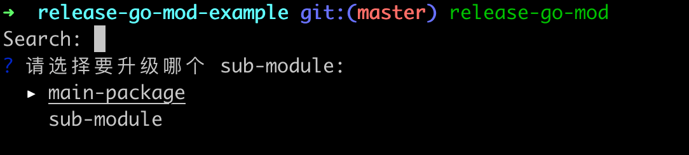
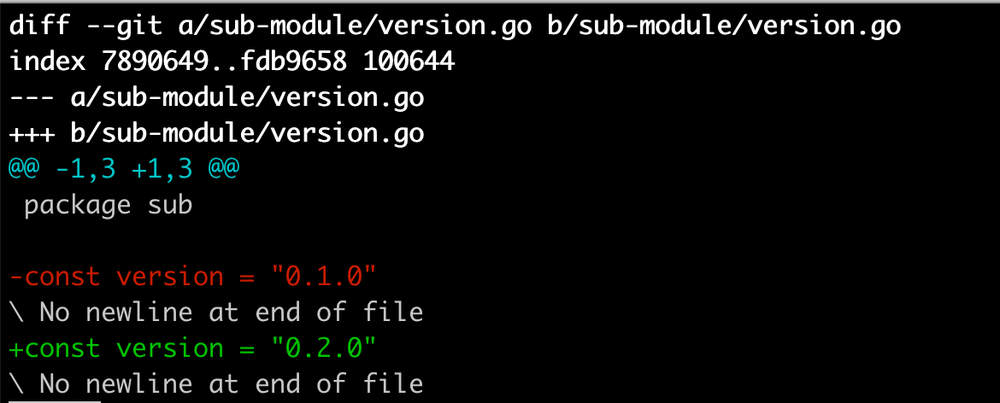

# release-go-mod

## Install

```shell
go install github.com/chyroc/release-go-mod@latest
```

## Usage

```shell
release-go-mod
```

## Feature

- 支持炫目主包，和子包



- 支持输入发布详情


- 支持自动读取当前版本，并自动按语义化版本选择下一个版本


- 效果


- 如果有 `.go` 文件包含老的版本字符串，会更新这个文件（如果没有，会忽略）
- 对 version 的文件名，变量名，位置都没有任何要求，只判定字符串包含关系


